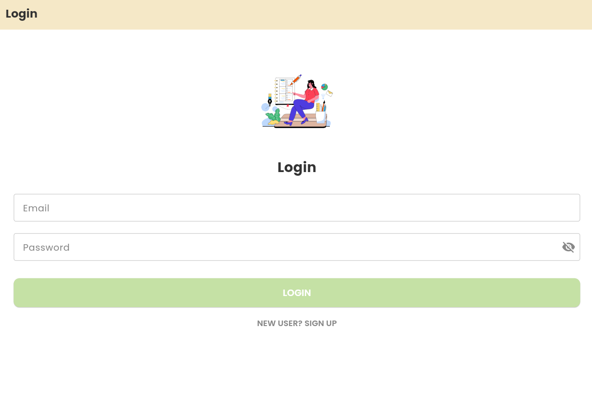
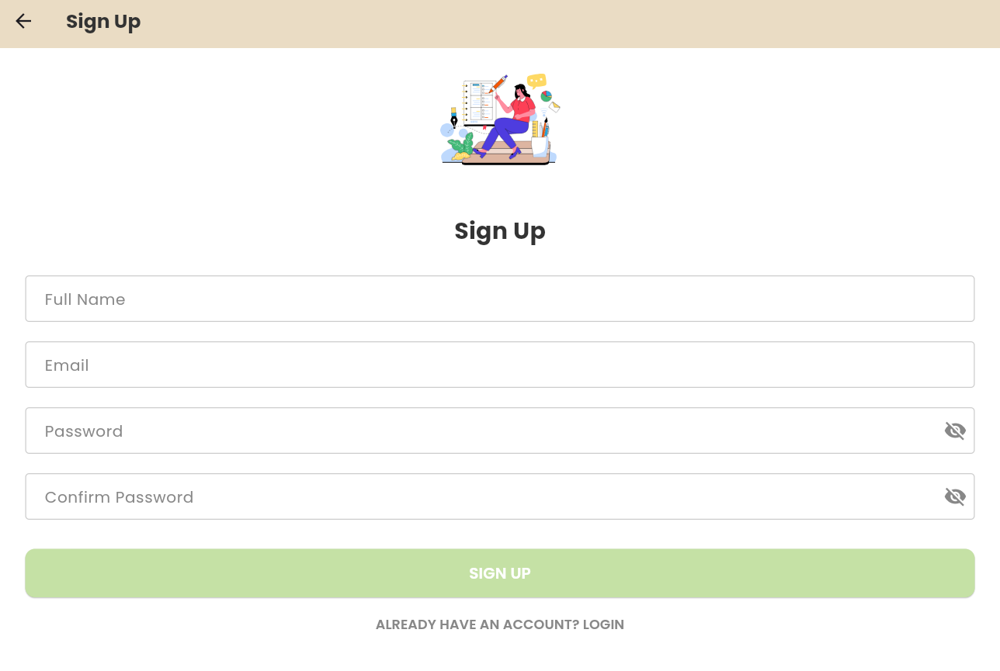
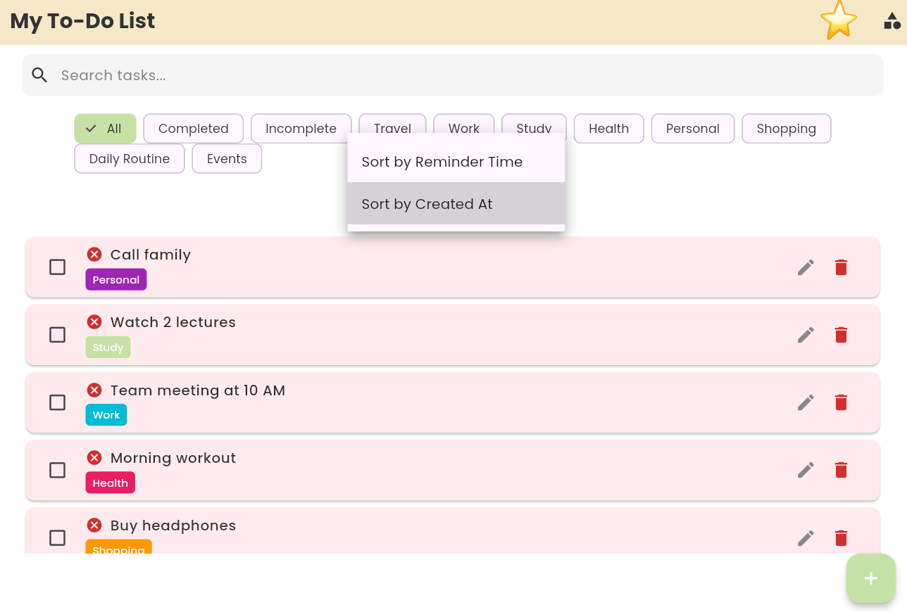
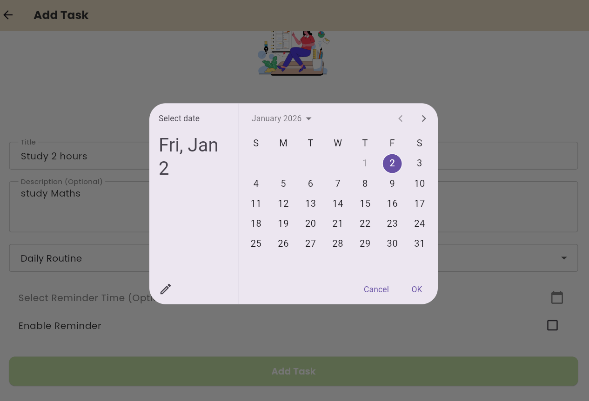
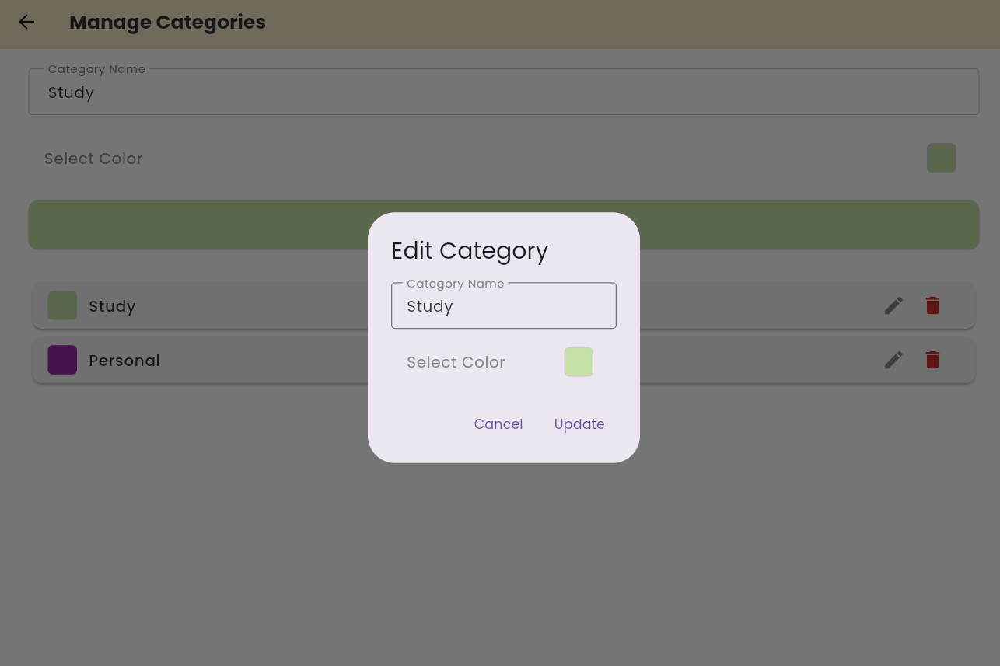

# Flutter Todo App with Firebase

A modern To-Do List application built with **Flutter** and **Firebase**.

## Features

- User Authentication (Login / Sign Up)
- Real-time task management with Firebase Firestore
- Custom categories with colors
- Search & Filters (Completed / Incomplete / Category)
- Task reminders
- Clean UI with animations (Lottie)
- State Management using Provider

## Tech Stack

- Flutter & Dart
- Firebase Auth
- Cloud Firestore
- Provider (State Management)
- Lottie Animations
- Google Fonts

## Screenshots

### Splash & Auth

### Home & Tasks

## How to Run

1. Clone the repository:

git clone https://github.com/bushra-devs/flutter-todo-firebase.git

2. Open the project and run:

flutter pub get  
flutter run

## Note

Make sure to add your own `firebase_options.dart` and configure Firebase project.

---

Developed by [Bushra](https://github.com/bushra-devs)

---
